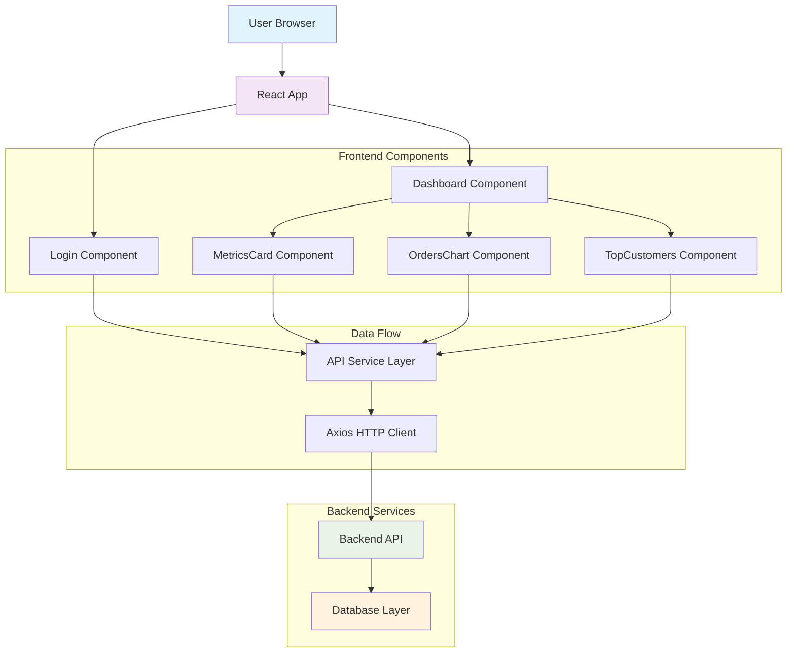

# 📊 Shopify Insights Dashboard - Frontend

A modern, responsive React dashboard for visualizing Shopify store analytics and customer insights. Built with React 19, Tailwind CSS, and Recharts for beautiful data visualization.

## 🌟 Features

- **Modern Authentication**: Glassmorphism login interface with email-based authentication
- **Real-time Analytics**: Live dashboard with auto-refreshing metrics every 10 seconds
- **Interactive Charts**: Beautiful line and bar charts for orders and customer analytics
- **Responsive Design**: Fully responsive design that works on all devices
- **Performance Optimized**: Built with React 19 and optimized for production

## 🛠️ Tech Stack

- **Frontend Framework**: React 19.1.1
- **Styling**: Tailwind CSS 3.4.0
- **Charts**: Recharts 3.2.0
- **HTTP Client**: Axios 1.12.2
- **Routing**: React Router DOM 7.9.1
- **Build Tool**: Create React App
- **Testing**: Jest + React Testing Library

## 📁 Project Structure

```
insights-dashboard/
├── public/                 # Static assets
│   ├── favicon.ico
│   ├── index.html
│   ├── manifest.json
│   └── robots.txt
├── src/
│   ├── components/         # React components
│   │   ├── Dashboard.js    # Main dashboard component
│   │   ├── Login.js        # Authentication component
│   │   ├── MetricsCard.js  # Reusable metrics display
│   │   ├── OrdersChart.js  # Orders timeline visualization
│   │   └── TopCustomers.js # Top customers bar chart
│   ├── api.js             # API service layer
│   ├── App.js             # Root application component
│   ├── App.css            # Component styles
│   ├── index.css          # Global styles with Tailwind
│   └── index.js           # Application entry point
├── package.json           # Dependencies and scripts
├── tailwind.config.js     # Tailwind CSS configuration
├── postcss.config.js      # PostCSS configuration
└── .env                   # Environment variables
```

## 🚀 Setup Instructions

### Prerequisites

- **Node.js** (version 16 or higher)
- **npm** or **yarn**
- **Backend API** running on http://localhost:4000 (or configure REACT_APP_BACKEND_URL)

### Installation Steps

1. **Clone the repository**
   ```bash
   git clone https://github.com/Surajadde07/XENO_FRONTEND.git
   cd insights-dashboard
   ```

2. **Install dependencies**
   ```bash
   npm install
   ```

3. **Configure environment variables**
   ```bash
   # Create .env file in root directory
   REACT_APP_BACKEND_URL=http://localhost:4000
   ```

4. **Start the development server**
   ```bash
   npm start
   ```

5. **Build for production**
   ```bash
   npm run build
   ```

6. **Run tests**
   ```bash
   npm test
   ```

### Environment Variables

| Variable | Description | Default |
|----------|-------------|---------|
| `REACT_APP_BACKEND_URL` | Backend API base URL | `http://localhost:4000` |

## 🏗️ Architecture Diagram



## 🔌 API Endpoints

### Base Configuration
- **Base URL**: `http://localhost:4000`
- **Authentication**: API Key header (`x-api-key: somekey`)
- **Content-Type**: `application/json`

### Insights Endpoints

| Method | Endpoint | Description | Response |
|--------|----------|-------------|----------|
| `GET` | `/insights/totals` | Get total customers, orders, and revenue | `{ totalCustomers: number, totalOrders: number, totalRevenue: number }` |
| `GET` | `/insights/orders-by-date` | Get orders grouped by date with optional date range | `[{ createdAt: string, _count: { _all: number }, _sum: { totalPrice: number } }]` |
| `GET` | `/insights/top-customers` | Get top 5 customers by total spend | `[{ name: string, totalSpend: number }]` |

### Data Ingestion Endpoints

| Method | Endpoint | Description |
|--------|----------|-------------|
| `POST` | `/ingest/customers` | Ingest customer data from Shopify |
| `POST` | `/ingest/products` | Ingest product data from Shopify |
| `POST` | `/ingest/orders` | Ingest order data from Shopify |

### Query Parameters

**Orders by Date Endpoint**:
- `startDate` (optional): Start date for filtering (YYYY-MM-DD)
- `endDate` (optional): End date for filtering (YYYY-MM-DD)

### Example API Calls

```javascript
// Get dashboard totals
const totals = await getTotals();

// Get orders for date range
const orders = await getOrdersByDate('2024-01-01', '2024-12-31');

// Get top customers
const customers = await getTopCustomers();
```

## 🗄️ Database Schema (Expected Backend)

Based on the API responses, the backend likely uses the following schema:

### Customers Table
```sql
CREATE TABLE customers (
  id SERIAL PRIMARY KEY,
  name VARCHAR(255),
  email VARCHAR(255) UNIQUE,
  total_spend DECIMAL(10,2),
  created_at TIMESTAMP,
  updated_at TIMESTAMP
);
```

### Products Table
```sql
CREATE TABLE products (
  id SERIAL PRIMARY KEY,
  shopify_id BIGINT UNIQUE,
  title VARCHAR(255),
  price DECIMAL(10,2),
  created_at TIMESTAMP,
  updated_at TIMESTAMP
);
```

### Orders Table
```sql
CREATE TABLE orders (
  id SERIAL PRIMARY KEY,
  shopify_id BIGINT UNIQUE,
  customer_id INTEGER REFERENCES customers(id),
  total_price DECIMAL(10,2),
  created_at TIMESTAMP,
  updated_at TIMESTAMP
);
```

## 🎨 Component Architecture

### Login Component
- **Purpose**: User authentication interface
- **Features**: Modern glassmorphism design, form validation, loading states
- **State**: Email input, loading status
- **Props**: `onLogin` callback function

### Dashboard Component
- **Purpose**: Main application interface
- **Features**: Auto-refreshing data, responsive grid layout
- **State**: Metrics totals
- **Props**: `onLogout` callback function

### MetricsCard Component
- **Purpose**: Reusable metric display
- **Features**: Consistent styling, hover effects
- **Props**: `title` (string), `value` (string/number)

### OrdersChart Component
- **Purpose**: Orders timeline visualization
- **Features**: Line chart with dual Y-axis (orders count + revenue)
- **State**: Chart data array
- **Library**: Recharts ResponsiveContainer + LineChart

### TopCustomers Component
- **Purpose**: Customer spending visualization
- **Features**: Horizontal bar chart showing top 5 customers
- **State**: Customer data array
- **Library**: Recharts ResponsiveContainer + BarChart

## 🔄 Data Flow

1. **Authentication**: User enters email → stored in localStorage → renders Dashboard
2. **Dashboard Load**: Component mounts → fetches totals from API → updates state
3. **Auto-refresh**: Every 10 seconds → re-fetch all data → update components
4. **Chart Updates**: API data → transform to chart format → render with Recharts
5. **Logout**: Clear localStorage → redirect to Login

## ⚡ Performance Features

- **Code Splitting**: React.lazy() for route-based splitting
- **Memoization**: React.memo() for expensive components
- **Auto-refresh**: Intelligent polling with cleanup
- **Responsive Images**: Optimized assets in public folder
- **CSS Optimization**: Tailwind purging + PostCSS optimization

## 🎯 Known Limitations & Assumptions

### Limitations

1. **Authentication**: 
   - Simple email-only authentication (no password validation)
   - No JWT tokens or session management
   - Authentication state stored only in localStorage

2. **Data Refresh**:
   - Fixed 10-second refresh interval (not configurable)
   - No real-time WebSocket connections
   - No optimistic updates or loading states for individual components

3. **Error Handling**:
   - Basic console.error logging only
   - No user-friendly error messages for API failures
   - No retry mechanisms for failed requests

4. **Responsive Design**:
   - Limited mobile optimization for complex charts
   - No touch gestures for chart interactions

5. **Browser Support**:
   - Requires modern browsers (ES6+ support)
   - localStorage dependency (no fallback)

### Assumptions

1. **Backend API**:
   - Assumes backend is always available at configured URL
   - Expects specific response formats from API endpoints
   - Assumes API key authentication is sufficient

2. **Data Format**:
   - Date strings are in ISO format
   - Numeric values are properly formatted
   - Customer names are always available (fallback to "Unknown")

3. **User Behavior**:
   - Users will access from desktop/laptop primarily
   - Single user session (no multi-user considerations)
   - Users understand basic dashboard concepts

4. **Environment**:
   - Development and production environments have similar configurations
   - Backend API maintains consistent response schemas
   - Network connectivity is generally stable

### Future Improvements

- Implement proper JWT-based authentication
- Add real-time data updates with WebSockets
- Enhance error handling with user notifications
- Add data caching and offline support
- Implement advanced filtering and date range selection
- Add more chart types and customization options
- Enhance mobile responsiveness
- Add unit and integration tests
- Implement proper loading states and skeleton screens

## 📄 License

This project is part of the Shopify Xeno Frontend application.

## 🤝 Contributing

1. Fork the repository
2. Create a feature branch (`git checkout -b feature/amazing-feature`)
3. Commit your changes (`git commit -m 'Add some amazing feature'`)
4. Push to the branch (`git push origin feature/amazing-feature`)
5. Open a Pull Request

---

**Built with ❤️ using React, Tailwind CSS, and modern web technologies**
